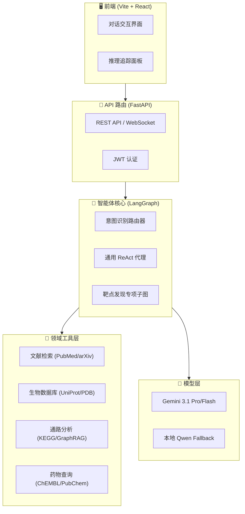
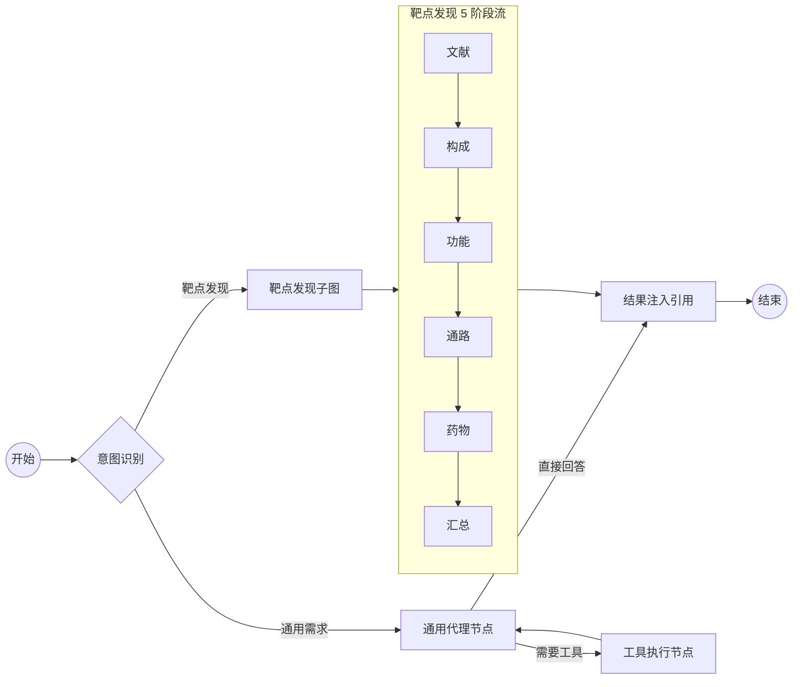

# AIDD Agent 意图识别与系统架构说明

本文档详细介绍了 AIDD Agent 的意图识别工作原理、系统整体架构、各类核心 Prompt 的设计细节以及复杂的动态生成与注入逻辑。

---

## 1. 系统架构设计 (System Architecture)

AIDD Agent 采用多层级、模块化的架构设计，结合了 LangGraph 的状态管理能力和领域特定的工具链。

### 1.1 整体架构图
系统由前端 UI、FastAPI 后端、LangGraph 智能体核心以及多源异构数据存储组成：



### 1.2 LangGraph 运行流架构
Agent 的核心执行逻辑通过 LangGraph 编排，实现了从意图识别到任务执行的闭环：



---

## 2. 用户意图识别 (Intent Recognition)

### 2.1 识别逻辑
每当用户发送消息时，`intent_router` 节点会拦截输入，并利用 LLM 强大的语义理解能力进行分类。

| 触发工作流 | 识别特征 |
| :--- | :--- |
| **靶点发现 (Target Discovery)** | 提到基因/蛋白质名称（如 EGFR, TDP-43）并要求调研、分析或生成报告。 |
| **通用对话 (General Agent)** | 闲聊、询问通用科学知识或不涉及特定靶点深度分析的任务。 |

---

## 3. 核心节点 Prompt 深度解析

Agent 的表现高度依赖于精心设计的 Prompt 体系。以下是各核心环节的 Prompt 细节。

### 3.1 意图路由节点 (`intent_router`)
用于判断用户需求并提取靶点名称。
```text
You are an intent router for an AI Drug Discovery (AIDD) platform. Your task is to analyze the user's message and determine whether to trigger the "target_discovery" workflow.

# Trigger Conditions (Route to "target_discovery")
Trigger this route if the user's message meets ANY of the following:
- Mentions specific gene/protein names (e.g., EGFR, KRAS, BTK, PD-1) AND requests analysis, review, research, or drug discovery context.
- Contains concepts or keywords like: "target analysis", "target research", "target discovery", "target report", "drugs targeting [Target]", "drug-target interactions".

# Exclusion Conditions (Route to "general")
Do NOT trigger this route if the message is:
- General chit-chat or greetings.
- Asking for general medical advice or symptom checking (e.g., "How to treat a headache?").
- Only mentioning a marketed drug without asking about its mechanism or target (e.g., "What is the dosage for Aspirin?").

# Output Format
Output strictly a valid JSON object ONLY, without any markdown formatting (do not use ```json) or additional explanations.

Use the following schema:
{
  "route": "target_discovery" | "general",
  "target_query": "Extract the specific gene/protein name or core target keyword here. If no specific target/keyword is found, output null."
}

# Examples
User: "Can you provide a comprehensive research report on KRAS G12C inhibitors?"
Output: {"route": "target_discovery", "target_query": "KRAS G12C"}

User: "What are the common side effects of taking Ibuprofen?"
Output: {"route": "general", "target_query": null}

User: "Help me find novel drugs targeting the BTK pathway."
Output: {"route": "target_discovery", "target_query": "BTK"}
```

### 3.2 通用代理系统提示词 (General Agent System Prompt)
通用代理使用 Jinja2 模板渲染，包含环境上下文和记忆上下文。其核心包含 **5 条强制性准则**：

1.  **严禁捏造**：任何 scientific 结论必须紧跟来源标识符（如 `[PMID:xxxxxxxx]`、`[DOI:xx.xxxx/xxxx]`）。
2.  **数据不足处理**：若检索结果不足以回答，必须明确说明“当前通过检索未发现相关数据”，严禁使用大模型自带的旧知识。
3.  **思维链强制化**：强制将思考过程放在 `<thought>` 标签中，最终回答放在 `<answer>` 标签中。
4.  **动态工具发现**：当现有工具不足时，必须优先调用 `tool_search` 查找专业工具，不得直接拒绝用户。
5.  **引用规范**：直接使用工具返回的标识符进行引用，无需重复原始 JSON 数据。

### 3.3 助手前缀强制注入 (Assistant Prefill)
为了确保模型始终遵循“先思考后回答”的模式，系统在每次调用 LLM 时都会强制注入 **`<thought>\n`** 作为助手消息的开头。这迫使模型在任何输出前必须先进入思维链模式。

---

## 4. Prompt 动态生成与注入逻辑 (详述)

本系统的核心竞争力在于 Prompt 的动态性与节点间的“知识接力”，确保了多阶段任务的严谨性。

### 4.1 变量插值渲染 (Jinja2 & Placeholder)
系统通过 `_render()` 工具函数实现占位符的实时替换。
- **靶点工作流**：将系统识别出的 `target_query` 注入到所有 5 个子节点的 System Prompt 中，例如：`"Task: Find representative papers for {{ target_query }}"`。
- **汇总节点**：将前 5 个节点产生的所有中间 JSON 结果聚合为 `sub_results_json`，并一次性注入到 `SYNTHESIZE_PROMPT` 中，作为汇总的唯一事实来源。
- **通用代理**：实时注入 `current_time`（系统时钟）、`active_tools`（当前挂载工具列表）以及从数据库提取的 `session_memory`（对话摘要）。

### 4.2 跨节点知识注入 (Prior Context Injection)
这是解决模型“ID 幻觉”的关键技术。在靶点发现子图中，`composition` 节点会首先确定蛋白质的官方 **UniProt Accession**。
- **逻辑实现**：`_resolved_accession_context` 函数会解析蛋白质构成节点的结果，生成类似 `"UniProt accession: P00533 (gene: EGFR)"` 的精炼文本。
- **注入点**：这段文本作为 `prior_context` 被注入到随后启动的 `function`、`pathway` 和 `drugs` 节点的 **User Prompt** 开头，并附带最高优先级的指令约束（"❗ MANDATORY CONSTRAINT"），强制模型在后续工具调用中必须使用这些经过验证的 Accession，不得自行猜测。

### 4.3 节点超时容错与强制总结
由于医药数据库 API 可能响应缓慢，每个节点都配置了独立的超时监控逻辑（如 300s）：
- **动态修正**：一旦检测到 `asyncio.TimeoutError`，系统会立即拦截当前的 ReAct 循环，并在消息队列末尾注入一条紧急指令：
  > "Execution time limit reached. Based on the tool query results gathered so far, please directly output the final JSON summary..."
- **效果**：这强制模型放弃继续调用工具，转而对已获取的碎片化信息进行“尽力而为”的总结，从而保证即便部分数据源挂掉，用户依然能得到一份不完整的但格式正确的报告。

### 4.4 自动上下文压缩提示词 (Auto-Compaction)
当对话 Tokens 超过 144k 时，系统会启动深度摘要逻辑：
- **Jinja2 渲染**：将长对话历史送入 `COMPACT_PROMPT`。
- **多维解析**：要求模型在 `<analysis>` 标签中先进行多维分析，最终输出包含用户意图、关键实体、查询记录、待办任务等 9 个维度的 `<summary>`。这个 Summary 将作为后续所有轮次 System Prompt 的 `memory_context` 部分，实现无限长度对话的支持。

---
*本文档由 AIDD 智能体后端系统生成。*
