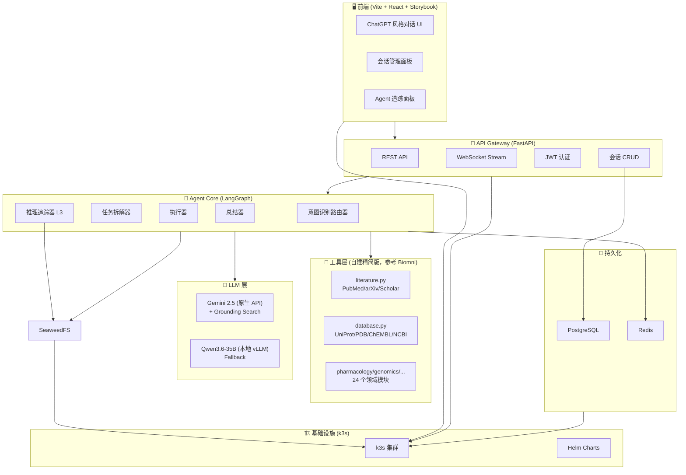
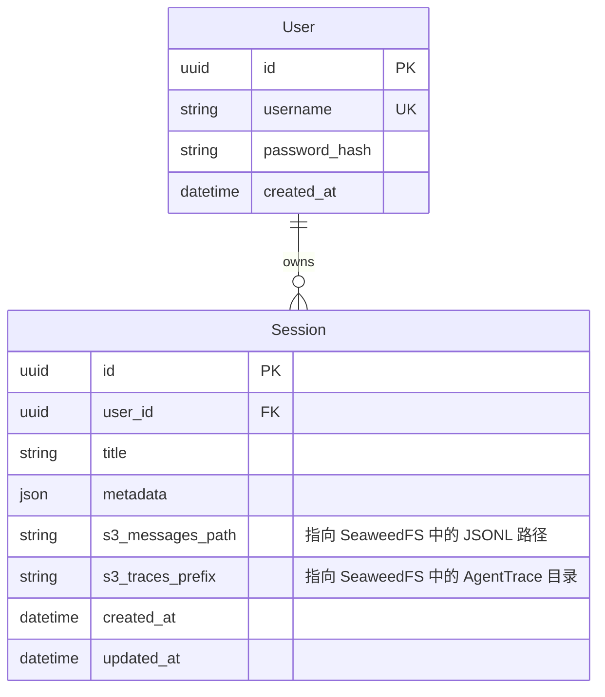
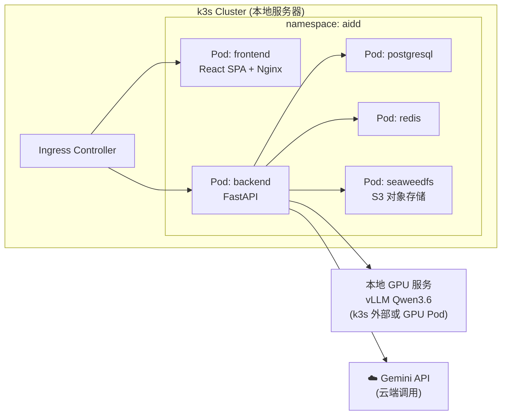

# AIDD Agent Platform — 产品设计文档 (v2)

> [!NOTE]
> 本版本已根据用户反馈更新所有决策点，所有 Open Questions 已关闭。

### 📑 细分设计文档

| 文档 | 说明 |
|------|------|
| [前端设计文档](./前端设计文档.md) | 组件树、状态管理 (Zustand)、WebSocket 协议、UI 规范、Storybook 计划 |
| [后端设计文档](./后端设计文档.md) | API 路由、ORM 模型、JWT 认证、Agent 集成、LangGraph 定义、部署配置 |

## 1. 项目背景与目标

构建一个类似 ChatGPT 的 **AI-Driven Drug Discovery (AIDD) 平台**，由 Agent 驱动，面向生物、化学、医药领域。

**核心价值**：对话式交互 → Agent 自主搜索领域知识 → 意图识别与任务拆分 → 总结生成结果 → 全链路推理追踪

---

## 2. 确认的核心决策

| # | 决策项 | 结论 |
|---|--------|------|
| 1 | **项目结构** | ✅ 新建独立项目，参考 Biomni 实现逻辑自建精简工具层，不直接依赖 biomni 包 |
| 2 | **前端框架** | ✅ React (Vite + TS) + **Storybook** 组件开发测试 + **Playwright** E2E 测试 |
| 3 | **用户管理** | ✅ 简单多用户（用户名+密码），无邮箱认证，仅做演示用；对话需按用户隔离 |
| 4 | **搜索 API** | ✅ 仅使用 Biomni 已有搜索工具，暂不接入额外专业 API |
| 5 | **Gemini 接入** | ✅ 使用 Gemini 原生 API（Function Calling + Grounding with Google Search） |
| 6 | **部署方式** | ✅ 本地服务器 + **k3s** 编排；Gemini 通过官方 API 云端调用 |
| 7 | **追踪粒度** | ✅ Level 3 完整追踪（prompt/response/token/cost/latency） |

---

### 3. 已有工具抽取与精简分析

> [!TIP]
> 我们不再直接 `pip install biomni`，而是将其中核心的搜索工具抽取出来，剥离掉冗余代码，形成**自建精简工具层 (`app/tools`)**。

绝大多数搜索工具基于**公开免费 REST API**，无需额外 API Key。

| 模块分类 | 核心工具函数 | 需要 API Key? | 说明 |
|----------|----------|:---:|------|
| **文献搜索** | `query_pubmed` | ❌ | 提取 pymed 逻辑，直接查 NCBI |
| **文献搜索** | `query_arxiv` | ❌ | 提取 arxiv 逻辑 |
| **通用搜索** | `search_google` | ❌ | 使用 googlesearch-python 或 Gemini Grounding |
| **蛋白/基因** | `query_uniprot`, `query_pdb` | ⚠️ **LLM Key** | 使用 LLM 辅助构造查询参数 |
| **药物/化学** | `query_chembl`, `query_pubchem` | ⚠️ **LLM Key** | 医药核心库，需配置好 Gemini Key |

**结论**：只需配置好 **Gemini API Key**，所有精简出来的工具即可运行。对于海量返回值的库（如 ChEMBL），需要在工具内部增加 Pydantic 硬修剪和 Map-Reduce 降维。

---

## 4. Gemini 原生 API vs OpenAI 兼容模式

> 你问了「接入原生 Gemini 有什么收益？」，以下是对比分析：

| 维度 | OpenAI 兼容模式 (现有) | Gemini 原生 API (推荐) |
|------|:---:|:---:|
| **Grounding (Google Search)** | ❌ 不支持 | ✅ 内置 Google 搜索，Agent 可自动搜索实时信息 |
| **Function Calling** | ⚠️ 部分支持 | ✅ 完整支持，含 parallel function calling |
| **高并发性能** | ⚠️ 兼容层有额外开销 | ✅ 更少 429 错误，延迟更低 |
| **Thinking Mode** | ❌ 不支持 | ✅ Gemini 2.5 支持 thinking budget |
| **Code Execution** | ❌ 不支持 | ✅ 内置安全代码执行沙箱 |
| **可用性** | 已有代码可直接切换 | 需用 `google-genai` SDK |

**推荐方案**：采用 Gemini 原生 API，核心收益是 **Grounding with Google Search** — Agent 在领域搜索时可自动结合 Google 搜索获取实时信息，这与你的「领域知识搜索」需求直接匹配。

---

## 5. 前端测试方案

> 你问了「有什么框架可以方便开发人员进行测试？」

推荐组合方案：

| 工具 | 用途 | 说明 |
|------|------|------|
| **Storybook** | 组件开发 & 视觉测试 | 独立运行每个 UI 组件，可视化调试，自动生成组件文档 |
| **Vitest** | 单元测试 | Vite 原生测试框架，快速，支持 React Testing Library |
| **Playwright** | E2E 端到端测试 | 真实浏览器测试完整用户流程（对话、搜索、追踪面板） |
| **MSW** | API Mock | 模拟后端 API，前端可独立于后端开发和测试 |

典型工作流：开发组件时用 Storybook 实时预览 → Vitest 跑单元测试 → Playwright 跑完整流程测试

---

## 6. 系统架构设计



---

## 7. 技术栈 (最终确认)

### 前端
| 技术 | 选择 |
|------|------|
| 框架 | Vite + React 19 + TypeScript |
| UI 组件 | Shadcn/ui |
| 状态管理 | Zustand |
| 实时通信 | WebSocket |
| 组件测试 | **Storybook** + Vitest + React Testing Library |
| E2E 测试 | **Playwright** |
| API Mock | **MSW (Mock Service Worker)** |

### 后端
| 技术 | 选择 |
|------|------|
| 框架 | FastAPI |
| ORM | SQLAlchemy 2.0 + Alembic |
| 关系型数据库 | PostgreSQL (用户、会话元数据) |
| 对象存储 | **SeaweedFS / S3** (对话历史、Agent Trace 审计日志、大文件归档) |
| 缓存 | Redis (热点上下文) |
| 认证 | JWT（用户名+密码，简单验证） |

### Agent 核心
| 技术 | 选择 |
|------|------|
| Agent 框架 | LangGraph (StateGraph) |
| LLM | **Gemini 原生 SDK** (`google-genai`) + 本地 Qwen Fallback |
| 领域工具 | **自建精简工具层**（参考 Biomni 实现逻辑，按需提取核心搜索/查询函数，去除冗余） |
| 追踪 | 自建 Level 3 Tracer + 可选 LangFuse |

### 部署
| 技术 | 选择 |
|------|------|
| 编排 | **k3s** (轻量 Kubernetes) |
| 容器 | Docker |
| 配置管理 | Helm Charts / Kustomize |
| Gemini | 云端 API 调用 |
| Qwen3.6 | 本地 GPU 服务 (vLLM on RTX 5090) |

---

## 8. 数据模型设计



> **注意**：为了应对极高的 token 占用和追踪日志，仅在 PostgreSQL 存储轻量的元数据。庞大的对话记录 (Messages) 和子代理的运行审计日志 (AgentTrace) 直接以 JSON/JSONL 格式存储在 **SeaweedFS (S3)** 中。

> User 模型简化：仅 username + password_hash，无邮箱。Session 通过 user_id 外键实现对话隔离。

---

## 9. 里程碑计划

### Milestone 1: 基础会话管理
- 前端对话 UI (React + Shadcn/ui + Storybook)
- 用户注册/登录 (用户名+密码, JWT)
- 会话 CRUD API (FastAPI + PostgreSQL)
- 消息流式输出 (WebSocket)
- 多用户对话隔离
- **产出**：能创建会话、发送消息、查看历史、切换会话、多用户隔离

### Milestone 2: 接入领域搜索工具层
- 构建自建精简工具层 (`app/tools`)，提取 Biomni 核心逻辑
- 实现大规模搜索结果的三层清洗降维管道 (硬修剪、重排、Map-Reduce)
- 封装统一搜索接口层 (PubMed/arXiv/Scholar/UniProt/PDB 等)
- 配置 Gemini API Key 使 LLM 辅助查询构造可用
- 搜索结果卡片式前端展示
- **产出**：对话中可进行领域知识搜索

### Milestone 3: 接入 Gemini 原生 API
- 集成 `google-genai` SDK
- Function Calling 绑定 Biomni 工具
- Grounding with Google Search 实时搜索
- Fallback 到本地 Qwen3.6
- Token 统计 & 成本追踪
- **产出**：Gemini 驱动对话推理 + 搜索增强

### Milestone 4: Agent 意图识别 + 任务拆分
- 意图识别模块 (LLM prompt-based)
- 任务拆解引擎 (LangGraph Multi-step)
- 搜索→总结 Pipeline
- 结果聚合 + 引用标注
- **产出**：Agent 可自主完成「搜索→查询→总结」完整流程

### Milestone 5: Agent 推理追踪
- AgentTrace Level 3 数据采集
- 实时推理流 WebSocket 推送
- Trace 面板 UI (展开式步骤卡片)
- Prompt/Response 原始数据查看器
- Token & Cost 统计面板
- **产出**：完整追踪 Agent 每步推理

---

## 10. k3s 部署架构



需要的 k3s 资源：
- **Deployment**: frontend, backend (各 1-2 replicas)
- **StatefulSet**: postgresql, redis, seaweedfs
- **Ingress**: Nginx/Traefik 反向代理
- **ConfigMap/Secret**: API keys, 数据库/S3 连接配置
- **PVC**: PostgreSQL 与 SeaweedFS 数据持久化

---

## 11. 项目目录结构

```
aidd-platform/
├── frontend/                    # React 前端
│   ├── src/
│   │   ├── components/         # UI 组件
│   │   ├── hooks/              # 自定义 hooks
│   │   ├── stores/             # Zustand stores
│   │   ├── services/           # API 调用
│   │   └── types/              # TypeScript 类型
│   ├── .storybook/             # Storybook 配置
│   ├── e2e/                    # Playwright E2E 测试
│   └── package.json
│
├── backend/                     # FastAPI + LangGraph 后端
│   ├── app/
│   │   ├── api/                # API 路由 (REST + WS)
│   │   ├── models/             # SQLAlchemy 模型
│   │   ├── agent/              # LangGraph 核心, Prompts, Context 管理
│   │   ├── tools/              # 领域工具层 (精简自 Biomni)
│   │   ├── core/               # k3s 配置映射 (pydantic-settings)
│   │   └── db/                 # PG/Redis/SeaweedFS 连接
│   ├── alembic/                # DB 迁移
│   └── environment.yml         # Mamba 统一环境依赖
│
├── deploy/                      # k3s 部署
│   ├── helm/                   # Helm Charts
│   ├── Dockerfile.frontend
│   ├── Dockerfile.backend
│   └── k3s-manifests/
│
└── README.md
```

---

## 12. Verification Plan

### 自动化测试
- **Vitest**: Agent 模块单元测试 + React 组件测试
- **Playwright**: 前端 E2E（对话、搜索、追踪面板）
- **pytest + httpx**: FastAPI 路由集成测试
- **Storybook**: 组件视觉回归测试

### 手动验证
- k3s 部署后，测试典型对话场景：药物查询、文献搜索、靶点分析
- 验证 Agent 追踪面板正确展示每步推理
- 验证多用户对话隔离
- 压力测试并发会话
